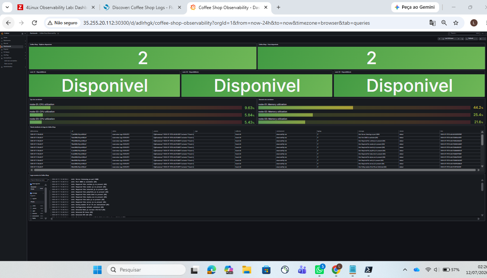

# Relatório Técnico - Coffee Shop Observability

## 1. Visão geral

O objetivo deste projeto foi criar um ambiente de observabilidade para a aplicação Coffee Shop utilizando três servidores Linux em um cluster k3s.

A solução integra as seguintes tecnologias:

- Ansible;
- k3s e Kubernetes;
- GitHub Actions;
- Prometheus;
- Grafana;
- Zabbix;
- OpenSearch;
- OpenSearch Dashboards;
- Fluent Bit.

O ambiente permite acompanhar métricas da aplicação, estado do cluster, disponibilidade dos servidores, utilização de recursos e logs.

## 2. Infraestrutura e automação

O cluster foi criado com três nós:

- `node-01`: control plane do k3s e OpenSearch;
- `node-02`: worker e componentes como Zabbix e OpenSearch Dashboards;
- `node-03`: worker.

A preparação dos servidores e a instalação do k3s foram realizadas com Ansible.

Também foram criadas automações para:

- instalação do Zabbix Agent 2;
- configuração dos agentes;
- ajuste do parâmetro `vm.max_map_count`;
- preparação dos servidores para o OpenSearch.

Os playbooks foram executados novamente para validar a idempotência, sem recriar configurações já existentes.

## 3. Aplicação Coffee Shop e CI/CD

A aplicação Coffee Shop foi implantada no namespace:

`coffee-shop`

O Deployment possui duas réplicas, distribuídas entre os nós workers `node-02` e `node-03`.

A aplicação foi exposta através do NodePort:

`30080`

A disponibilidade foi validada com resposta HTTP 200.

O endpoint abaixo também foi validado:

`/metrics`

Esse endpoint disponibiliza métricas no formato Prometheus.

Foi configurado um pipeline no GitHub Actions para realizar o build e a publicação da imagem no GitHub Container Registry.

Os manifestos da aplicação estão versionados no repositório e permitem reaplicar o deploy de forma declarativa.

A etapa de deploy do pipeline deve ser conferida no GitHub Actions antes da entrega final para garantir que todos os jobs foram concluídos com sucesso.

## 4. Prometheus e Grafana

Foi instalado o `kube-prometheus-stack`, contendo:

- Prometheus;
- Grafana;
- Alertmanager;
- kube-state-metrics;
- node-exporter.

Foi criado um ServiceMonitor para que o Prometheus descubra o endpoint `/metrics` da Coffee Shop.

Os dois targets da aplicação foram identificados corretamente pelo Prometheus.

O Grafana foi configurado com três fontes de dados:

- Prometheus;
- Zabbix;
- OpenSearch.

Também foram instalados os plugins:

- `alexanderzobnin-zabbix-app`;
- `grafana-opensearch-datasource`.

## 5. Monitoramento com Zabbix

O ambiente Zabbix foi implantado no Kubernetes com:

- Zabbix Server;
- Zabbix Web;
- PostgreSQL.

O Zabbix Agent 2 foi instalado nos três servidores através do Ansible.

Foram cadastrados os hosts:

- `node-01`;
- `node-02`;
- `node-03`.

Foram validadas métricas como:

- disponibilidade do agente;
- CPU;
- memória;
- uptime;
- filesystem;
- conectividade ICMP;
- disponibilidade da porta SSH.

Os três servidores ficaram disponíveis no Zabbix e enviando dados normalmente.

## 6. OpenSearch e Fluent Bit

O OpenSearch foi instalado em modo single-node devido aos limites de disco e recursos do laboratório.

O cluster foi validado com status:

`green`

O OpenSearch Dashboards foi configurado para consulta e análise dos logs.

O Fluent Bit foi implantado como DaemonSet nos workers `node-02` e `node-03`.

A coleta utiliza buffer em memória e envia os logs para o índice:

`kubernetes-logs-*`

Os registros recebem campos como:

- `collector: fluent-bit`;
- `environment: observability-lab`;
- `stream`;
- `message`;
- `@timestamp`.

A integração foi validada com a mensagem:

`FLUENT_BIT_TEST_1783793287 coffee-shop observability`

A mensagem foi localizada no OpenSearch Dashboards e no Grafana.

Também foi criada uma política de retenção de um dia para reduzir o crescimento dos índices.

## 7. Dashboard consolidado

Foi criado o dashboard:

`Coffee Shop Observability`

O dashboard reúne dados do Prometheus, Zabbix e OpenSearch.

Os painéis apresentam:

- réplicas disponíveis da Coffee Shop;
- pods disponíveis;
- disponibilidade dos três servidores;
- utilização de CPU;
- utilização de memória;
- volume de logs;
- tabela detalhada de logs;
- mensagens recentes da aplicação.

O dashboard foi exportado e versionado em:

`grafana/coffee-shop-observability-dashboard.json`

## 8. Dificuldades, decisões e aprendizados

Durante a implantação do OpenSearch ocorreram problemas de pressão de disco nos nós do cluster.

Para estabilizar o ambiente foram realizadas as seguintes ações:

- limpeza de imagens de containers sem uso;
- movimentação do OpenSearch Dashboards para outro worker;
- execução do Fluent Bit apenas nos workers;
- utilização de buffer em memória;
- redução da retenção dos logs;
- configuração dos índices sem réplicas.

O plugin de segurança do OpenSearch foi desabilitado apenas para simplificar o laboratório. Em produção seria necessário utilizar autenticação, TLS, armazenamento maior, backup e alta disponibilidade.

Minha experiência anterior é principalmente com Zabbix e Grafana.

Durante este desafio aprofundei conhecimentos em Kubernetes, k3s, Ansible, Helm, Prometheus, OpenSearch, Fluent Bit e CI/CD.

Foram utilizadas documentação, pesquisa e ferramentas de IA como apoio, mas cada etapa foi executada, analisada e validada diretamente no ambiente.

## Evidência visual do dashboard

A imagem abaixo apresenta o dashboard consolidado no Grafana.

